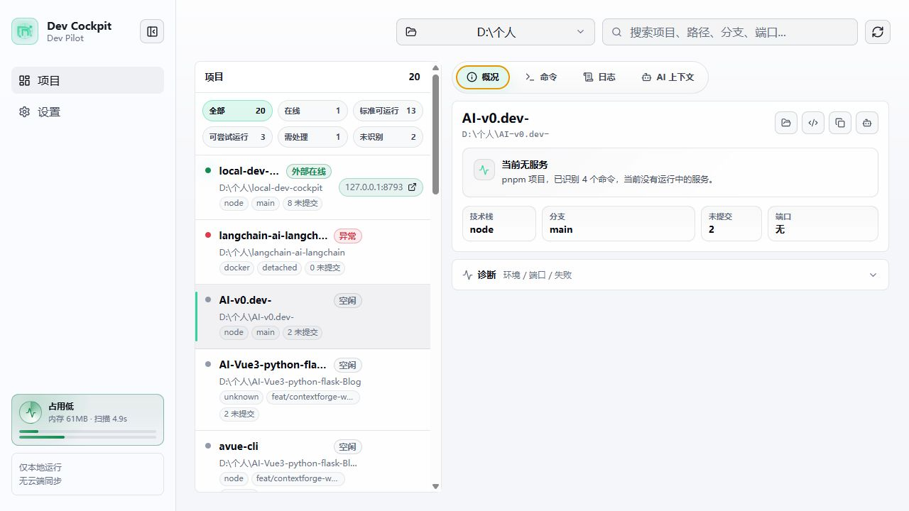
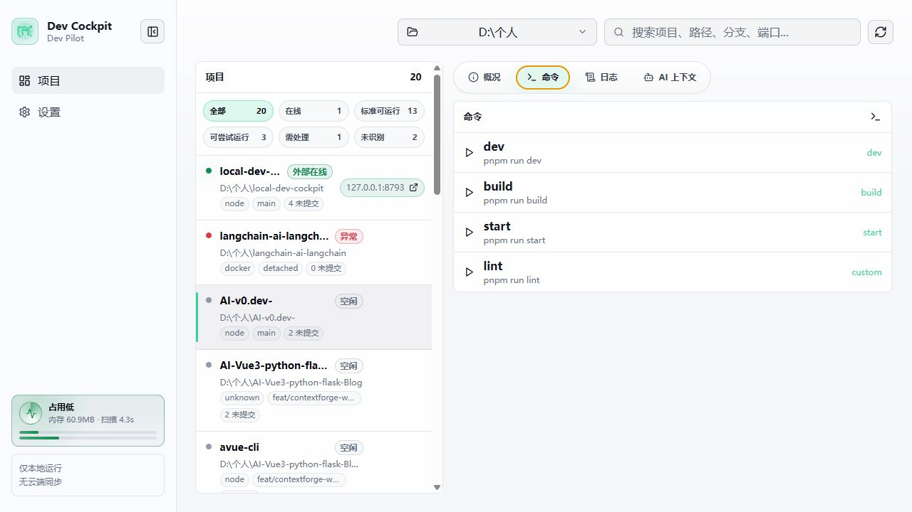
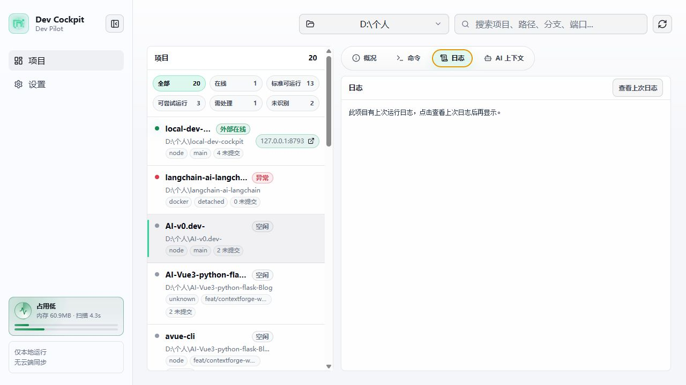
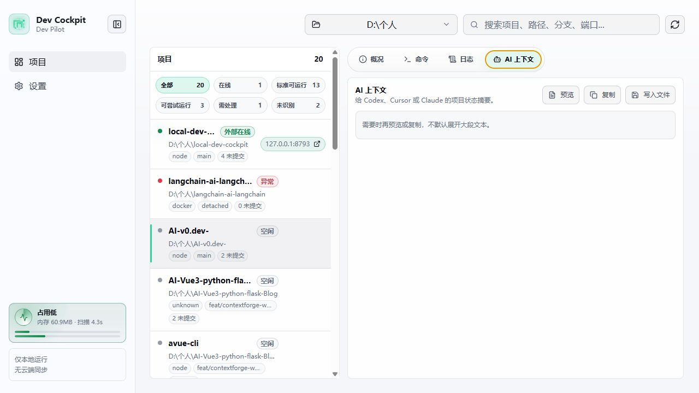
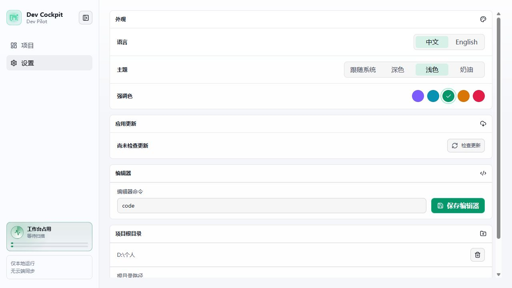
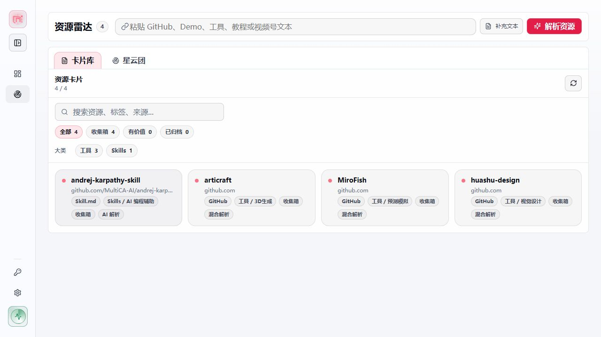

# Dev Cockpit

Dev Cockpit 是一个本地开发工作台，用来把电脑里的项目、启动命令、端口、日志、Git 状态和 AI 上下文放到同一个面板里。

它的目标很明确：**帮你快速恢复本地开发现场**。它不是 IDE，不替代 VS Code、Cursor、Docker Desktop 或 Conda；它更像一个轻量控制台，告诉你“哪个项目能跑、跑在哪个端口、上次为什么失败、下一步该做什么”。

English summary: Dev Cockpit is a local development dashboard for restoring project state, commands, logs, ports, Git status, runtime diagnostics, and AI coding context.

项目展示页：[linsk27 projects - Dev Cockpit](https://linsk27-github-io.vercel.app/projects/#dev-cockpit)

如果这个工具能帮你减少重复切换和项目恢复时间，欢迎 Star；我会优先根据 Star 和真实反馈继续打磨。

```bash
npx local-dev-cockpit
```

默认打开：

```txt
http://localhost:8787
```

桌面版下载：[GitHub Releases](https://github.com/linsk27/local-dev-cockpit/releases)

## 适合谁

- 同时维护多个前端、后端、脚本或实验项目的开发者。
- 经常在 VS Code、Cursor、终端和浏览器之间切换的人。
- 经常忘记项目启动命令、端口、上次错误或 Python 环境的人。
- 想把当前项目状态一键复制给 Codex、Cursor、Claude 等 AI coding agent 的人。

## 核心能力

- 扫描一个或多个本地工作区，自动发现 Git 项目和常见应用目录。
- 识别 Node、Python、Java、PHP、Ruby、.NET、Go、Rust、Docker 和混合项目。
- 从 `package.json`、Python 入口、Maven/Gradle、Docker Compose 等文件推断启动命令。
- 展示 Git 分支、未提交数量、运行端口、最近失败、日志和诊断结果。
- 从面板启动/停止托管命令，并实时查看日志。
- 识别外部已经运行的本地服务，例如你在终端或 VS Code 里启动的 Vite、Next.js、Uvicorn。
- 诊断端口占用、残留端口、缺少包管理器、缺少 Python/Conda 环境等常见问题。
- 生成和复制 AI 上下文，也可以写入 `PROJECT_CONTEXT.md` 和 `AGENTS.md`。
- 收集 AI skills、GitHub 仓库、Demo、工具、教程、提示词和视频号笔记线索，生成可筛选资源卡片、AI 上下文和类型化评估草稿。
- 支持中文/英文、浅色/深色/奶油主题、强调色和 Windows 桌面版。

## 快速开始

1. 启动面板：

   ```bash
   npx local-dev-cockpit
   ```

2. 打开 `http://localhost:8787`。

3. 在设置页添加一个工作区根目录，例如：

   ```txt
   D:\个人
   C:\Users\you\Projects
   ```

4. 回到项目页，选择一个项目。

5. 查看项目的命令、端口、日志、诊断和 AI 上下文。

6. 点击 `dev` / `start` 启动服务，或复制 AI 上下文交给 AI 分析。

默认只读取本地项目元数据，不上传代码；也不会写入你的项目目录。只有点击“写入文件”或执行 `context --write` 时，才会写入 `PROJECT_CONTEXT.md` 和 `AGENTS.md`。

## 页面截图

### 项目页：概况

项目页左侧是项目列表，支持搜索和状态筛选；右侧展示当前项目的运行状态、端口、Git 信息和诊断摘要。



### 项目页：命令

命令页展示可运行命令。标准脚本、推断命令和自定义命令会分开显示，启动前会检查端口和运行环境。



### 项目页：日志

日志页显示当前或上次运行日志。命令失败时，完整错误留在日志里，概况页只保留摘要，避免主界面过载。



### 项目页：AI 上下文

AI 上下文页会生成当前项目摘要，包括项目路径、技术栈、命令、端口、Git 状态和最近错误，方便复制给 AI。



### 设置页

设置页用于管理主题、语言、编辑器命令、工作区根目录和更新检查。



### 资源页：Resource Radar

资源页用于收集 AI skills、GitHub 仓库、在线 Demo、工具、提示词、MCP 和教程线索。粘贴 URL 后会先抓取 GitHub README、网页标题/摘要、Open Graph 图片、README 图片或页面图片，再生成结构化预览；确认后才会加入资源库，避免误点就产生脏卡片。

默认使用本地规则解析，不需要 AI Key。左侧底部的 `AI 配置` 可以选择供应商、填写 OpenAI-compatible Base URL、模型和 API Key，并用“测试连接”确认可用；也可以继续使用环境变量。配置后，导入时会先经过 AI 解析预览：

```bash
$env:DEV_COCKPIT_AI_API_KEY="your-key"
$env:DEV_COCKPIT_AI_BASE_URL="https://code.rayinai.com/v1"
$env:DEV_COCKPIT_AI_MODEL="gpt-5.4"
```

AI 解析只更新资源卡片的标题、类型、大类/小类、标签、摘要、置信度和可展示素材；不会执行代码、不会上传本地项目文件，也不会自动安装技能。分类不是写死的：导入时会把已有分类一起交给 AI，优先复用已有分类，只有不匹配时才创建新的大类/小类。

语言策略保持轻量：界面语言存于浏览器偏好，AI 输出自动跟随当前应用语言，不在 AI 配置页额外提供语言选择，也不引入额外 i18n 运行时包。资源原始标题和产品名会尽量保留。

当前本地规则已覆盖一批真实资源样例：React 动画组件会进入 `工具 / 前端开发`，3D 资产生成会进入 `工具 / 3D生成`，预测引擎会进入 `工具 / 预测模拟`，设计生成类仓库会进入 `工具 / 视觉设计`。大类只表达资源形态，小类表达用途；GitHub、开源项目、仓库来源只作为来源或标签，不再作为大类。后续新增规则必须优先补真实链接测试，避免分类越扩越乱。



## 使用案例

### 案例 1：恢复一个前端项目

1. 添加包含项目的根目录。
2. 在项目列表里选择前端项目。
3. 打开“命令”页，点击 `dev`。
4. Dev Cockpit 会显示运行端口，例如 `127.0.0.1:5173`。
5. 打开端口链接，在浏览器查看项目。

### 案例 2：查看别人电脑上为什么跑不起来

1. 让对方安装桌面版或运行 `npx local-dev-cockpit`。
2. 添加项目根目录。
3. 选择失败项目，进入“日志”和“诊断”。
4. 如果是缺依赖、端口占用、命令不存在或 Python 环境不对，面板会给出主要原因和下一步。
5. 复制 AI 上下文给你或 AI 工具继续分析。

### 案例 3：把项目状态交给 AI

1. 选择项目。
2. 打开“AI 上下文”。
3. 点击“预览”或“复制”。
4. 把内容发给 Codex、Cursor、Claude，让 AI 直接理解当前项目状态。

## 状态说明

Dev Cockpit 不只看自己启动的进程，而是综合判断项目状态：

- **托管运行**：由 Dev Cockpit 启动，可以在面板里停止。
- **外部在线**：系统检测到该项目已有本地服务，并且 HTTP 可访问；如果端口能归属到当前项目，概况区会提供停止端口入口。
- **需处理**：最近命令失败、环境缺失或端口状态异常，需要看诊断。
- **需清理**：检测到端口残留或端口被占用但 HTTP 不可访问，可在概况区清理；如果系统找不到可停止的 PID，会提示去原终端或任务管理器处理。
- **空闲**：未检测到运行中的服务。

为了避免误报，一个未知的 `localhost:3000` 不会让所有 Node 项目都显示在线。只有端口能归属到当前项目，或命令明确声明端口并通过本地 HTTP 探测时，才会显示在线。启动命令前也会检查命令声明的端口；如果端口已经被系统占用，会先阻止启动，避免跑起来后才报端口冲突。

## Python 和 Conda

Python 项目会尽量自动选择正确环境，优先级大致如下：

1. 项目详情里手动绑定的 Python/Conda 环境。
2. `.vscode/settings.json` 中的 `python.defaultInterpreterPath` 或 `python.pythonPath`。
3. 项目内 `.venv`、`venv`、`.conda`。
4. `environment.yml` / `environment.yaml` 声明的 Conda 环境。
5. `uv.lock`、Poetry、Pipenv 等项目工具。
6. 从同一个终端启动 Dev Cockpit 时继承的 `CONDA_PREFIX` / `VIRTUAL_ENV`。
7. 系统 `python` 或 Windows `py` launcher。

什么时候需要手动配置：

- 项目依赖装在某个全局 Conda 环境里，但项目目录没有 `.venv` 或 `environment.yml`。
- 你平时先 `conda activate xxx`，再在终端里运行项目。
- 桌面版双击启动后提示 `ModuleNotFoundError`，但你确认终端里能跑。
- 同一个仓库里有多个 Python 后端，需要为不同子目录绑定不同解释器。

可填写：

```txt
conda:环境名
C:\path\to\python.exe
```

Dev Cockpit 不会自动创建虚拟环境，也不会自动安装依赖。它只负责识别、诊断和给出下一步。

## CLI 命令

```bash
# 启动 Web 面板
npx local-dev-cockpit

# 扫描指定目录
npx local-dev-cockpit scan D:\个人

# 添加工作区根目录
npx local-dev-cockpit add-root D:\个人

# 检查本机 Git / Node / Python / Go / Cargo 等环境
npx local-dev-cockpit doctor

# 检查某个项目的运行环境和推荐命令
npx local-dev-cockpit doctor D:\个人\my-project

# 输出项目 AI 上下文
npx local-dev-cockpit context D:\个人\my-project

# 写入 PROJECT_CONTEXT.md 和 AGENTS.md
npx local-dev-cockpit context D:\个人\my-project --write
```

## 桌面版

Release 页面提供两个 Windows 产物：

```txt
Dev-Cockpit-Setup-<version>-win-x64.exe   标准安装向导，推荐日常使用
Dev-Cockpit-<version>-win-x64.exe         免安装版，适合临时试用
```

设置页支持检查更新。检查逻辑优先读取 GitHub Release；如果 GitHub 不可达，会回退到 npm registry 判断最新版本，再给出 Release 下载入口。

当前桌面产物未签名，Windows 可能提示未知发布者。正式公开分发前需要补代码签名。

## 本地数据

Dev Cockpit 的数据只保存在本机：

```txt
%APPDATA%\local-dev-cockpit\config.json
%APPDATA%\local-dev-cockpit\state.json
%APPDATA%\local-dev-cockpit\skill-radar.json
%APPDATA%\local-dev-cockpit\logs\*.log
```

默认不会写入你的项目目录。只有点击“写入文件”或执行 `context --write` 时，才会写入 `PROJECT_CONTEXT.md` 和 `AGENTS.md`。

## 项目结构

```txt
packages/core      项目扫描、技术栈识别、命令推断、Git/端口状态、AI 上下文
packages/server    本地 HTTP API、进程生命周期、日志、配置、更新检查
packages/cli       npx 入口、scan/doctor/context 命令、内置 Web 面板
apps/web           Vue 3 + Vite + Pinia Dashboard
apps/desktop       Electron 桌面壳，复用同一套 server 和 Web 面板
```

关键约束：

- `core` 不依赖 Vue、server 或 CLI。
- 命令执行使用 `command + args`，避免拼接 shell 字符串。
- API 输入使用 `zod` 校验。
- 日志使用内存 ring buffer + 文件落盘。
- CLI 发布包内置 Vue 面板，保证 `npx local-dev-cockpit` 独立运行。
- 新增依赖需要说明用途、替代方案、体积影响和是否按需加载；不是禁止增加包体，而是让功能收益匹配体积成本。

详细设计见 [docs/architecture.md](docs/architecture.md)。

## 开发

```bash
pnpm install
pnpm build
pnpm --filter local-dev-cockpit dev
```

质量检查：

```bash
pnpm release:check
```

Windows 桌面版：

```bash
pnpm --filter @local-dev-cockpit/desktop dist:win
```

## 当前阶段

当前版本重点是稳定本地项目恢复能力：更可靠地识别项目、启动命令、端口状态、Python/Conda 环境、日志和 AI 上下文。

后续不会急着堆新模块。下一步会优先收集真实用户试用问题，再决定是否扩展到更大的模块。
