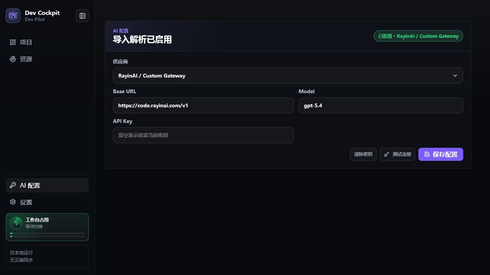

# Dev Cockpit

Dev Cockpit 是一个本地开发工作台，用来恢复和管理你电脑上的项目现场：项目列表、启动命令、运行端口、日志、Git 状态、Python/Conda 环境、AI 上下文和资源雷达。

它不是 IDE，也不替代 VS Code、Cursor、Docker Desktop 或 Conda。它解决的是一个更具体的问题：**打开一个工作区后，快速知道哪些项目能跑、跑在哪里、为什么失败、下一步做什么。**

English summary: Dev Cockpit is a local development dashboard for restoring project state, commands, logs, ports, Git status, runtime diagnostics, and AI coding context.

项目展示页：[linsk27 projects - Dev Cockpit](https://linsk27.github.io/projects/dev-cockpit/)

如果这个工具能帮你减少重复切换和项目恢复时间，欢迎 Star；我会优先根据 Star 和真实反馈继续打磨。

```bash
npx local-dev-cockpit
```

默认地址：

```txt
http://localhost:8787
```

Windows 桌面版下载：[GitHub Releases](https://github.com/linsk27/local-dev-cockpit/releases)

## 适合谁

- 同时维护多个前端、后端、脚本、实验项目的开发者。
- 经常忘记启动命令、端口、上次错误或 Python 环境的人。
- 想把项目状态一键复制给 Codex、Cursor、Claude 等 AI coding agent 的人。
- 经常收藏 AI skills、Demo、工具、教程和 GitHub 仓库，但缺少整理入口的人。

## 核心能力

- 扫描本地工作区，识别 Node、Python、Java、PHP、Ruby、.NET、Go、Rust、Docker 和混合项目。
- 推断常用启动命令，展示 Git 分支、未提交数量、端口、日志和诊断结果。
- 启动/停止 Dev Cockpit 托管命令，并识别外部终端或 VS Code 已经跑起来的本地服务。
- 解释项目状态来源：托管运行、外部端口、HTTP 可达、端口残留、端口冲突、命令失败。
- 生成 AI 上下文，也可写入 `PROJECT_CONTEXT.md` 和 `AGENTS.md`。
- 资源雷达：导入 GitHub、Demo、工具、教程、Prompt、MCP、Workflow 或视频号文本，生成可筛选资源卡片。
- 支持中文/英文、浅色/深色/奶油主题、Windows 桌面版。

## 快速开始

1. 启动：

   ```bash
   npx local-dev-cockpit
   ```

2. 打开 `http://localhost:8787`。

3. 在设置页添加工作区根目录，例如：

   ```txt
   D:\个人
   C:\Users\you\Projects
   ```

4. 回到项目页，选择项目。

5. 查看概况、命令、日志、诊断和 AI 上下文。

6. 点击 `dev` / `start` 启动服务，或复制 AI 上下文继续分析。

默认只读取本机项目元数据，不上传代码，也不会写入项目目录。只有你点击“写入文件”或执行 `context --write` 时，才会写入 `PROJECT_CONTEXT.md` 和 `AGENTS.md`。

## 真实用户试用清单

第一次试用建议按这个顺序验证：

1. 添加一个包含多个项目的根目录。
2. 在项目页搜索一个已知项目。
3. 打开命令页，运行 `dev` 或 `start`。
4. 查看概况区是否出现运行地址。
5. 如果提示端口冲突，先打开已有地址；需要重启时再停止对应端口。
6. 如果命令失败，打开日志页查看完整错误，诊断区只看主要原因和建议动作。
7. Python 项目缺依赖时，确认是否需要绑定 `.venv`、`conda:环境名` 或 `python.exe`。
8. 在 AI 上下文页复制当前项目状态给 AI。
9. 在资源页导入一个 GitHub 或 Demo 链接，确认预览后再入库。
10. 用资源页的导出/导入 JSON 在另一台机器同步同一批资源。

## 页面截图

### 项目概况

左侧是项目列表和状态筛选；右侧解释当前项目为什么在线、空闲、失败或需清理。


### 命令

命令页展示可运行脚本。启动前会检查端口和运行环境，避免重复启动导致端口冲突。


### 日志

日志页保留完整输出；概况和诊断页只展示摘要。


### AI 上下文

AI 上下文页生成项目路径、技术栈、命令、端口、Git 状态和最近错误摘要。


### 资源雷达

资源雷达用于沉淀 AI skills、GitHub 仓库、在线 Demo、工具、教程、Prompt、MCP、Workflow 和视频号文本。


### AI 配置

AI 配置用于资源导入阶段的结构化解析。没有 AI Key 时仍可使用本地规则生成预览。



### 设置

设置页管理主题、编辑器命令、工作区根目录和更新检查。


## 项目状态说明

Dev Cockpit 会综合判断项目状态：

- **托管运行**：由 Dev Cockpit 启动，可在面板里停止。
- **外部在线**：系统检测到该项目已有本地服务，并且 HTTP 可访问；如果端口能归属到当前项目，会显示打开和停止入口。
- **需处理**：最近命令失败、环境缺失或端口状态异常，需要看诊断。
- **需清理**：检测到端口残留或端口被占用但 HTTP 不可访问；如果系统找不到可停止 PID，会提示去原终端或任务管理器处理。
- **空闲**：未检测到运行中的服务。

为了避免误报，未知的 `localhost:3000` 不会让所有 Node 项目都显示在线。只有端口能归属到当前项目，或命令明确声明端口并通过本地 HTTP 探测时，才会显示在线。

## Python 和 Conda

Python 项目会尽量自动识别环境，优先级大致如下：

1. 项目详情里手动绑定的 Python/Conda 环境。
2. `.vscode/settings.json` 里的解释器路径。
3. 项目内 `.venv`、`venv`、`.conda`。
4. `environment.yml` / `environment.yaml` 声明的 Conda 环境。
5. `uv.lock`、Poetry、Pipenv 等项目工具。
6. 从同一个终端启动 Dev Cockpit 时继承的 `CONDA_PREFIX` / `VIRTUAL_ENV`。
7. 系统 `python` 或 Windows `py` launcher。

什么时候需要手动配置：

- 依赖装在全局 Conda 环境里，但项目目录没有 `.venv` 或 `environment.yml`。
- 你平时先 `conda activate xxx`，再在终端运行项目。
- 桌面版双击启动后提示 `ModuleNotFoundError`，但终端里能跑。
- 同一仓库里有多个 Python 后端，需要不同解释器。

可填写：

```txt
conda:环境名
C:\path\to\python.exe
```

Dev Cockpit 不会自动创建虚拟环境，也不会自动安装依赖。它只负责识别、诊断和给出下一步。

## 资源雷达

资源导入流程固定为：

```txt
粘贴链接或文本 -> 抓取网页/GitHub 元数据 -> 本地规则初判 -> 可选 AI 解析 -> 预览卡片 -> 确认入库
```

资源大类只表达形态：`工具 / Skills / Demo / 教程文章 / Prompt / MCP / Workflow / 未分类`。小类表达用途，例如：`前端开发 / 视觉设计 / 视频剪辑 / PPT生成 / 声音克隆 / 3D生成 / 预测模拟`。GitHub、开源项目、仓库来源只作为来源或标签，不作为大类。

AI 解析只更新资源卡片的标题、类型、大类/小类、标签、摘要、置信度和可展示素材；不会执行代码、不会上传本地项目文件，也不会自动安装 skills。

可选环境变量：

```bash
$env:DEV_COCKPIT_AI_API_KEY="your-key"
$env:DEV_COCKPIT_AI_BASE_URL="https://code.rayinai.com/v1"
$env:DEV_COCKPIT_AI_MODEL="gpt-5.4"
```

资源导出格式：

```json
{
  "app": "dev-cockpit-resource-radar",
  "version": 1,
  "exportedAt": "2026-06-02T00:00:00.000Z",
  "items": []
}
```

其他应用只要生成兼容的 `items` 数据，也可以通过资源页导入。导入时会校验字段、规范化大类/小类，并按 `id`、来源 URL、标题摘要跳过重复资源。

## 资源规模策略

资源雷达当前按 `1000-3000` 条本地资源设计，不提前引入数据库：

- 列表使用固定行高虚拟滚动，只渲染可视区域资源卡片。
- 搜索和筛选使用前端预计算索引，支持标题、摘要、标签、来源 URL、大类和小类。
- 星云图会按数量自动降级：少量资源显示完整节点；中等数量显示分类星团和代表资源；超过 1000 条默认只显示分类星团和数量。
- 导入资源包时会统计新增、重复跳过和失败数量；重复判断包含标准化 URL、GitHub owner/repo、标题+摘要指纹。
- 数据仍存放在本地 `skill-radar.json`。如果未来超过 5000 条或需要全文检索，再评估 SQLite/FlexSearch。

更多实现边界见 `docs/resource-scale.md`。

## CLI 命令

```bash
npx local-dev-cockpit
npx local-dev-cockpit scan D:\个人
npx local-dev-cockpit add-root D:\个人
npx local-dev-cockpit doctor
npx local-dev-cockpit doctor D:\个人\my-project
npx local-dev-cockpit context D:\个人\my-project
npx local-dev-cockpit context D:\个人\my-project --write
```

## 桌面版

Release 页面提供两个 Windows 产物：

```txt
Dev-Cockpit-Setup-<version>-win-x64.exe   标准安装向导，推荐日常使用
Dev-Cockpit-<version>-win-x64.exe         免安装版，适合临时试用
```

当前桌面产物未签名，Windows 可能提示未知发布者。正式公开分发前需要补代码签名。

## 本地数据

数据默认保存在：

```txt
%APPDATA%\local-dev-cockpit\
```

主要文件：

```txt
config.json          工作区根目录、编辑器命令、Python 环境绑定
state.json           最近运行状态和错误
skill-radar.json     资源雷达数据
ai-settings.json     AI 供应商、模型和本地密钥
logs\*.log           命令运行日志
```

## 开发与自检

```bash
pnpm install
pnpm release:check
pnpm verify:smoke
```

`verify:smoke` 是非破坏性检查：启动本地服务，访问 `/api/health`、项目列表、资源导出接口和前端入口，确认发版前的最小链路没有断。

## 架构

```txt
apps/web             Vue 3 + Vite Dashboard
apps/desktop         Electron 桌面壳
packages/core        项目扫描、技术栈识别、命令推断、Git/端口状态、AI 上下文
packages/server      本地 HTTP API、进程管理、端口控制、资源雷达、AI 配置
packages/cli         npx local-dev-cockpit 启动入口
```

关键边界：

- `core` 不依赖 Vue、server 或 CLI。
- `server` 管 HTTP API、进程、端口、资源和本地持久化。
- `web` 只负责展示、交互和前端状态。
- 资源雷达数据只保存在本机，不默认上传。

## 当前边界

- 不做云同步、账号系统和团队协作。
- 不做系统级抓包或浏览器扩展。
- 不自动安装项目依赖、不自动创建 Python 虚拟环境。
- 不自动安装 AI skills，只做收集、解析、沉淀和导出。
