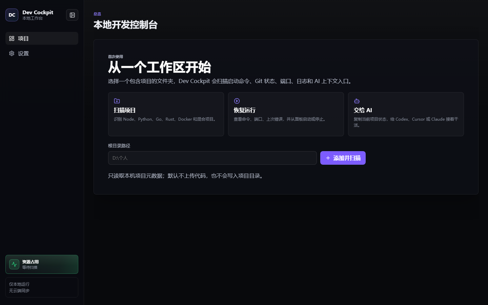
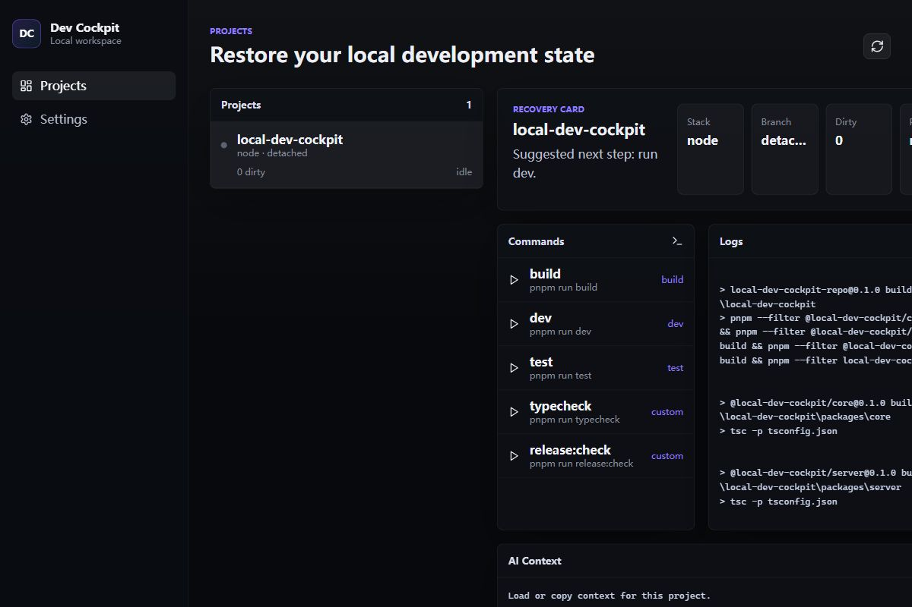
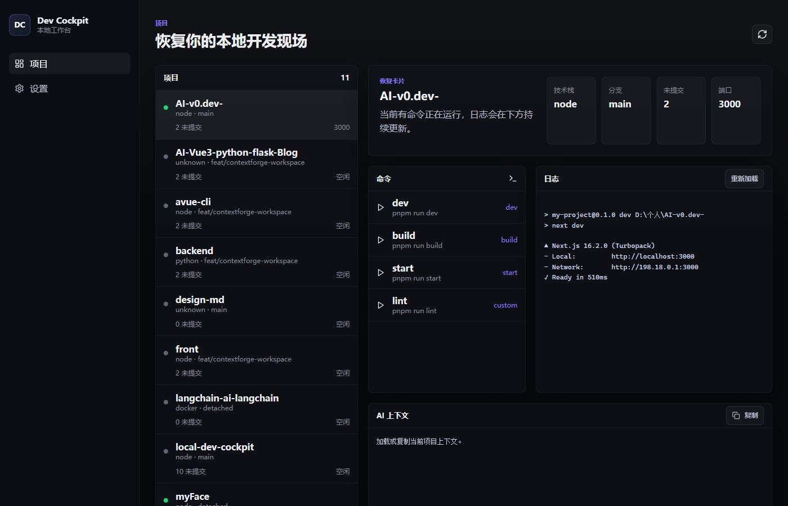
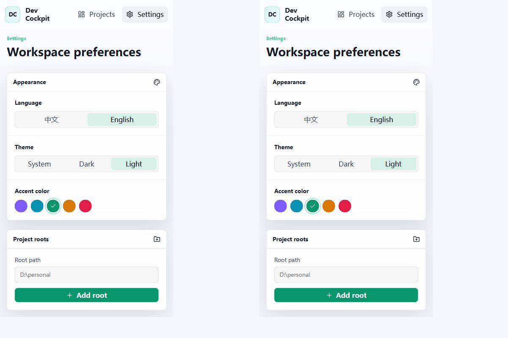

# Dev Cockpit

Dev Cockpit 是一个本地开发工作台：把电脑里的项目、启动命令、Git 状态、端口、日志和 AI 上下文放到同一个面板里，帮助你快速恢复开发现场。

> 定位：本机项目的“开发现场恢复台”。它不是 IDE、不是云平台，也不是 AI 聊天工具。

```bash
npx local-dev-cockpit
```

默认打开：

```txt
http://localhost:8787
```

桌面版下载：[GitHub Releases](https://github.com/linsk27/local-dev-cockpit/releases)

## 适合谁

- 同时维护多个前端、后端、脚本、实验项目的个人开发者。
- 经常在 VS Code、Cursor、终端、浏览器之间切换的人。
- 经常忘记“这个项目怎么启动、跑在哪个端口、上次为什么失败”的人。
- 需要把项目状态快速交给 Codex、Cursor、Claude 等 AI coding agent 的人。

## 不适合谁

- 只维护一个项目，并且 IDE 已经完整保存启动配置。
- 需要团队权限、云同步、CI/CD、线上监控或生产运维平台。
- 希望它替代 VS Code、JetBrains、Docker Desktop 或 Conda 管理工具。

## 一分钟上手

1. 运行 `npx local-dev-cockpit`。
2. 打开 `http://localhost:8787`。
3. 选择一个工作区目录，例如 `D:\个人` 或 `C:\Users\you\Projects`。
4. 在项目列表选择项目。
5. 查看命令、端口、日志、诊断和 AI 上下文。
6. 点击 `dev` / `start` 启动服务，或复制上下文交给 AI。

默认只读取本机项目元数据，不上传代码；也不会写入项目目录，除非你显式点击“写入文件”或执行 `context --write`。

## 界面预览

首次使用：



项目总览：



多项目和端口状态：



主题与语言：



## 核心功能

- 扫描本机工作区，识别 Git 项目和常见应用目录。
- 识别 Node、Python、Java、PHP、Ruby、.NET、Go、Rust、Docker 和混合项目。
- 从 `package.json`、Flask/FastAPI/Django、Maven/Gradle/Spring Boot、Laravel/Composer、Rails/Rack、Docker Compose 等入口推断常用命令。
- 展示 Git 分支、未提交文件数、运行端口、最近失败和状态依据。
- 支持从面板启动/停止托管命令，并实时查看日志。
- 识别外部已启动服务，例如 VS Code 或终端里已经跑起来的 Vite、Next.js、Uvicorn。
- 对端口占用、残留端口、缺少包管理器、缺少 Python/Conda 环境等情况给出诊断。
- 生成和复制 AI 上下文，也可显式写入 `PROJECT_CONTEXT.md` 和 `AGENTS.md`。
- 支持中文/英文、多主题、多强调色。
- 支持 Windows 安装包和免安装版。

## 状态判断

Dev Cockpit 不只看自己启动的进程。项目状态按可信度合并：

- `托管运行`：由 Dev Cockpit 启动，可在面板中停止。
- `外部在线`：系统检测到该项目已有本地服务，并且 HTTP 可访问。
- `需清理`：端口被占用，但 HTTP 不可访问，通常是残留进程或端口表未刷新。
- `异常`：最近一次命令失败，需要看日志或诊断。
- `空闲`：未检测到运行服务。

为避免误判，一个未知的 `localhost:3000` 不会让所有 Node 项目都显示在线。只有端口能归属到当前项目，或命令明确声明端口并通过本地 HTTP 探测时，才会显示为在线。

## Python 和 Conda

Python 项目会尽量自动选择正确环境，优先级大致如下：

1. 项目详情里手动绑定的 Python/Conda 环境。
2. `.vscode/settings.json` 中的 `python.defaultInterpreterPath` 或 `python.pythonPath`。
3. 项目内 `.venv`、`venv`、`.conda` 等虚拟环境。
4. `environment.yml` / `environment.yaml` 中声明的 Conda 环境。
5. `uv.lock`、Poetry、Pipenv 等项目工具。
6. 从同一个终端启动 Dev Cockpit 时继承的 `CONDA_PREFIX` / `VIRTUAL_ENV`。
7. 系统 `python` 或 Windows `py` launcher。

注意：Windows 桌面双击启动的应用不能读取另一个终端里 `conda activate` 后的状态。遇到“终端能跑、面板缺包”时，可以在项目详情的运行环境区选择候选环境，或填写：

```txt
conda:环境名
C:\path\to\python.exe
```

Dev Cockpit 不会自动安装依赖。出现 `ModuleNotFoundError` 时，它会提示你当前环境缺哪个模块，以及应该在哪个环境里安装。

## CLI

```bash
# 启动面板
npx local-dev-cockpit

# 扫描指定目录
npx local-dev-cockpit scan D:\个人

# 添加工作区根目录
npx local-dev-cockpit add-root D:\个人

# 检查本机运行环境
npx local-dev-cockpit doctor

# 检查某个项目的运行环境和推荐命令
npx local-dev-cockpit doctor D:\个人\my-project

# 输出项目 AI 上下文
npx local-dev-cockpit context D:\个人\my-project

# 写入 PROJECT_CONTEXT.md 和 AGENTS.md
npx local-dev-cockpit context D:\个人\my-project --write
```

## 桌面版

Release 页面提供两个 Windows 产物：

```txt
Dev-Cockpit-Setup-<version>-win-x64.exe   标准安装向导，推荐日常使用
Dev-Cockpit-<version>-win-x64.exe         免安装版，适合临时试用
```

设置页可以检查更新。检查逻辑优先读取 GitHub Release；如果 GitHub API 不可达，会退回 npm registry 判断最新版，再给出 Release 下载入口。

当前桌面产物未签名，Windows 可能提示未知发布者。正式公开分发前需要补代码签名。

## 本地数据

Dev Cockpit 的数据只保存在本机：

```txt
%APPDATA%\local-dev-cockpit\config.json
%APPDATA%\local-dev-cockpit\state.json
%APPDATA%\local-dev-cockpit\logs\*.log
```

默认不会写入你的项目目录。只有点击“写入文件”或执行 `context --write` 时，才会写入 `PROJECT_CONTEXT.md` 和 `AGENTS.md`。

## 项目架构

```txt
packages/core      项目扫描、技术栈识别、命令推断、Git/端口状态、AI 上下文
packages/server    本地 HTTP API、进程生命周期、日志、配置、更新检查
packages/cli       npx 入口、scan/doctor/context 命令、内置 Web 面板
apps/web           Vue 3 + Vite + Pinia Dashboard
apps/desktop       Electron 桌面壳，复用同一套 server 和 Web 面板
```

关键约束：

- `core` 不依赖 Vue、server 或 CLI。
- 命令执行使用 `command + args`，避免拼接 shell 字符串。
- API 输入使用 `zod` 校验。
- 日志使用内存 ring buffer + 文件落盘。
- CLI 发布包内置 Vue 面板，保证 `npx local-dev-cockpit` 独立运行。

详细设计见 [docs/architecture.md](docs/architecture.md)。

## 开发

```bash
pnpm install
pnpm build
pnpm --filter local-dev-cockpit dev
```

质量检查：

```bash
pnpm release:check
```

Windows 桌面版：

```bash
pnpm --filter @local-dev-cockpit/desktop dist:win
```

## 当前阶段

当前版本是 `0.1.12`。重点是把“本地项目恢复”这个核心流程做稳定：扫描、识别命令、诊断环境、运行/停止命令、查看日志、识别端口、交给 AI。

后续不会急着堆新模块。下一步会优先收集真实用户试用问题，再决定是否扩展到更大的模块。

