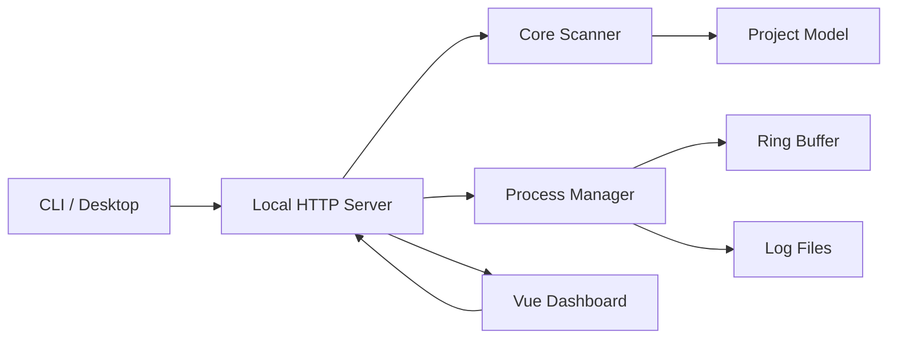

# Dev Cockpit 架构说明

Dev Cockpit 的目标不是替代 IDE，而是保存 IDE 不擅长表达的“开发现场”：项目入口、启动命令、运行状态、端口、日志、Git 摘要和 AI 上下文。

## 产品边界

Dev Cockpit 只做本地项目恢复：

- 不上传源码。
- 不接团队账号。
- 不做 CI/CD。
- 不替代 IDE。
- 不自动安装依赖。
- 不默认写入用户项目。

这让它可以作为一个轻量本地工具长期挂着，而不是变成重型开发平台。

## 分层

```txt
apps/web
  Vue 3 Dashboard，只负责展示和用户操作。

apps/desktop
  Electron 桌面壳。启动同一个本地 server，并用原生窗口承载 Vue 面板。

packages/cli
  npx 入口。启动 server、打开浏览器，并提供 scan / doctor / context 命令。

packages/server
  本地 HTTP API。负责配置、扫描聚合、进程启动停止、日志、端口状态和更新检查。

packages/core
  纯 TypeScript 核心。负责项目识别、命令推断、Git 状态、端口候选和上下文生成。
```

`core` 是最稳定边界。它不依赖 Vue、HTTP、CLI 或 Electron。桌面版复用 `apps/web` 和 `packages/server`，不复制业务逻辑。

## 数据流



核心对象是 `Project`：

```ts
Project {
  id: string
  name: string
  path: string
  kind: "node" | "python" | "go" | "rust" | "docker" | "mixed" | "unknown"
  git: { branch: string; dirtyCount: number; lastCommit?: string }
  commands: Command[]
  ports: PortStatus[]
  lastRun?: ProcessRun
  lastError?: ErrorSummary
}
```

前端不直接推断项目状态。它只消费 server 返回的项目模型，并在 `project-view.ts` 里做展示层归类。

## 扫描策略

扫描从用户配置的 root 开始，按深度递归查找项目标记：

- `.git`
- `package.json`
- `requirements.txt`
- `pyproject.toml`
- `go.mod`
- `Cargo.toml`
- `Dockerfile`
- `docker-compose.yml`
- `pom.xml`
- `build.gradle`
- `composer.json`
- `Gemfile`
- `.csproj` / `.sln`

默认忽略：

```txt
node_modules
.git
dist
build
.venv
target
.next
.cache
```

扫描有深度、数量和超时保护。工作区越具体，体验越稳定；不建议直接扫描整个磁盘。

## 命令模型

命令统一保存为结构化数据：

```ts
Command {
  id: string
  label: string
  command: string
  args: string[]
  cwd: string
  source: "package-script" | "detected" | "user"
  kind: "dev" | "test" | "build" | "start" | "custom"
}
```

执行时使用 `command + args`，不拼接 shell 字符串。这样能降低跨平台差异和注入风险。

第一阶段只自动执行可信来源：

- `package.json scripts`
- 框架标准命令
- 后续用户显式添加的命令

## 状态模型

项目状态不是单一来源，而是多路合并：

1. `托管运行`：Dev Cockpit 自己启动的进程仍在运行。
2. `外部在线`：系统端口和进程命令行能归属到当前项目，并且 HTTP 可访问。
3. `需清理`：端口属于当前项目或命令声明端口，但 HTTP 不可访问。
4. `异常`：最近一次命令失败。
5. `空闲`：没有运行服务。

公共端口不会直接作为在线证据。比如 `localhost:3000` 被未知进程占用时，不会把所有 Node 项目都标成在线。

## 运行环境解析

命令推断和运行环境解析分开：

- `core` 推断“应该怎么跑”。
- `server` 在启动前根据当前机器解析“实际用哪个运行时跑”。

Python 优先级：

1. 项目级手动绑定。
2. `.vscode/settings.json`。
3. 项目内 `.venv` / `venv` / `.conda`。
4. 父级工作区虚拟环境。
5. `environment.yml` 的 Conda 环境。
6. uv / Poetry / Pipenv。
7. 启动 Dev Cockpit 的终端继承环境。
8. 系统 Python 或 Windows `py`。

Java 优先使用 `mvnw` / `gradlew` wrapper；没有 wrapper 再用系统 Maven/Gradle。JDK 缺失会在启动前拦截。

Node 优先使用 `packageManager` 字段和 lockfile 推断包管理器。pnpm/yarn 会优先尝试 Corepack；必要时在存在 npm lockfile 的项目里回退 npm。

## 日志策略

进程输出同时进入：

- 内存 ring buffer：用于实时展示。
- 本地日志文件：用于刷新后恢复。

日志目录：

```txt
%APPDATA%\local-dev-cockpit\logs
```

停止后的历史日志不会默认铺满页面，需要用户显式查看，避免“没操作就出现日志”的误解。

## 性能策略

Dev Cockpit 需要能长期挂着，所以默认避免高频全量扫描：

- 当前 root 的扫描结果在 server 侧短时间缓存。
- 手动刷新会绕过缓存。
- 运行中项目才高频刷新日志和状态。
- 页面隐藏时暂停自动刷新。
- 端口探测按 host/port 去重。
- Windows 端口和进程命令行查询短时间复用。
- 性能面板只展示 Dev Cockpit 自身开销，不触发项目扫描。

这个策略牺牲几秒级的外部状态发现速度，换取长期挂后台时更低的 CPU 和磁盘占用。

## 本地配置

```txt
%APPDATA%\local-dev-cockpit\config.json
%APPDATA%\local-dev-cockpit\state.json
%APPDATA%\local-dev-cockpit\logs\*.log
```

配置包含 root、编辑器命令和项目级 Python 环境绑定。语言、主题和强调色属于前端偏好，保存在浏览器 `localStorage`。

## 发布策略

`packages/cli` 发布到 npm。发布包内置：

- CLI 入口
- server bundle
- core bundle
- Vue 面板静态产物

因此用户只需要：

```bash
npx local-dev-cockpit
```

桌面端使用 Electron。主进程启动同一个本地 server，再加载本地 Web 面板。它只是原生包装层，不维护第二套 UI 和业务逻辑。

## 当前痛点

- 端口归属在 Windows 上相对可控，macOS/Linux 还需要补更强的进程归属策略。
- Python/Conda 环境场景复杂，自动识别只能覆盖常见结构，仍需要手动绑定兜底。
- 真实项目框架差异大，命令推断需要持续增加 fixture 和真实案例。
- Electron 安装包未签名，普通用户下载时会遇到 Windows 安全提示。
- 当前没有自动更新，只能检查更新并跳转下载。
- UI 已经收敛，但信息密度仍然高，需要继续靠真实用户反馈决定哪些信息默认隐藏。

