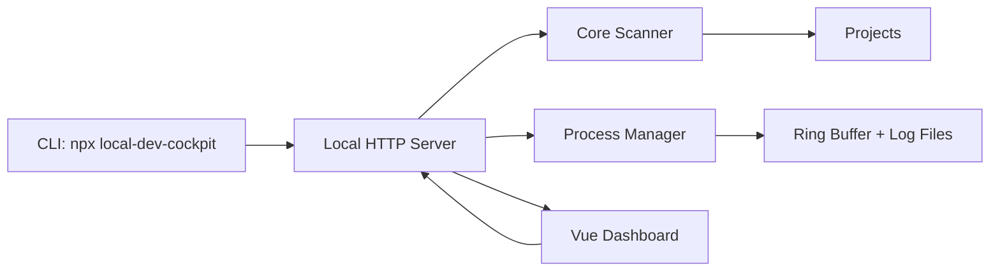

# Dev Cockpit 架构说明

Dev Cockpit 的目标不是替代 IDE，而是补齐 IDE 不擅长保存的“开发现场”：项目入口、启动命令、运行状态、端口、日志、Git 摘要和 AI 上下文。

## 分层

```txt
apps/web
  Vue 3 Dashboard，只负责展示和用户操作。

apps/desktop
  Electron 桌面壳。启动同一个本地 server，并用原生窗口承载 Vue 面板。

packages/cli
  npx 入口。启动 server、打开浏览器，并提供 scan / doctor / context 命令。

packages/server
  本地 HTTP API。负责读取配置、扫描项目、启动/停止进程、记录日志、推送事件。

packages/core
  纯 TypeScript 核心。负责项目识别、命令推断、Git 状态、端口检测和上下文生成。
```

`core` 是最稳定的边界。它不依赖 Vue、HTTP、CLI，也不直接假设桌面端存在。Electron 桌面版复用 `apps/web` 和 `packages/server`，不 fork 业务逻辑。

## 前端偏好

语言、主题和强调色属于纯展示偏好，第一版保存在浏览器 `localStorage`，不写入 server 配置文件。编辑器命令属于本机能力配置，保存在 server 配置文件里，默认是 `code`。

相关代码：

```txt
apps/web/src/stores/preferences.ts
apps/web/src/styles.css
```

当前支持：

- 语言：中文、英文。
- 主题：跟随系统、深色、浅色。
- 强调色：紫色、青色、绿色、琥珀色、玫瑰色。

## 交互策略

Dashboard 的首要目标是降低“下一步该做什么”的判断成本，而不是展示尽可能多的按钮：

- 首次启动不自动把当前命令目录加入根目录；用户必须显式选择工作区，避免 `npx` 缓存目录或临时目录进入项目列表。
- 项目列表优先展示在线项目，并展示项目路径和可点击运行地址。
- 首页只选择一个具体根目录作为当前工作区；项目扫描、状态刷新和侧栏性能指标都限定在该根目录内。
- 恢复卡片只展示项目概况、当前状态和运行地址，不再承载运行/停止按钮。
- 恢复卡片提供快捷操作区：打开项目文件夹、用配置编辑器打开项目、复制项目路径和复制 AI 上下文，作为回到本地文件和 AI 编程上下文的最短路径。
- 项目详情区域固定高度，概况、命令、日志和 AI 上下文使用标签页切换，减少纵向堆叠和突兀的大块文本。
- 命令区保留完整命令列表，但运行中只允许一个命令处于活跃状态，避免重复启动同一个项目。
- 命令、刷新、复制上下文和显式写入上下文文件使用轻量 toast 反馈，避免点击后没有响应。
- 设置页负责项目根目录的查看、添加和移除，避免用户直接编辑 `%APPDATA%` 下的配置文件。
- 日志区优先展示当前运行命令的日志；停止后的历史日志需要用户点击查看，减少“没操作就出现日志”的误解。
- 命令页会加载轻量运行环境诊断，把命令标记为可运行、需确认或缺环境；缺少硬运行时的命令会在 UI 和 server 两层被拦截。

## 数据流



## 在线状态策略

在线状态不能只依赖 Dev Cockpit 自己启动的进程，因为用户可能已经在 VS Code、Cursor 或系统终端里手动启动了服务。当前按三层来源合并：

- 托管运行：由 Dev Cockpit 启动的命令，状态来自 `ProcessManager`，地址从日志里的 `localhost` / `127.0.0.1` / `::1` URL 解析。
- 外部运行：server 读取 Windows 当前监听端口和进程命令行；如果命令行包含项目路径，并且本地 HTTP 探测可访问，就把该端口归属为在线。
- 显式端口兜底：如果命令声明了端口，并且当前扫描结果里只有一个项目声明该端口，会再做一次轻量 HTTP 探测；只有浏览器可访问时才把它归属为在线，否则标为需清理。

公共端口探测只用于提示，不直接参与“在线”判断，避免一个未知 `3000` 进程把所有 Node 项目都显示为在线。Dashboard 在无托管进程时也会低频刷新项目列表，所以外部启动/停止会反映到总览。
如果端口属于该项目但 HTTP 探测失败，Dashboard 只保留为“需清理”状态，提示用户停止残留端口，不再把它当作可打开的运行地址。
端口清理按幂等语义处理：如果系统端口表返回旧 PID，但清理后端口已关闭，就视为成功；只有端口仍在监听时才提示权限不足、系统代理托管或需要关闭原终端。

## 运行环境解析

命令推断和命令启动分开处理：

- `packages/core` 只负责识别项目类型和推荐命令，例如 Python 的 `python -m uvicorn ...`、Maven 的 `spring-boot:run`、Gradle 的 `bootRun`、Laravel 的 `artisan serve`、Rails 的 `rails server`、.NET 的 `dotnet run`。
- `packages/server` 在真正启动前解析本机运行环境，例如 Python `.venv`、父级工作区虚拟环境、Conda `environment.yml`、已激活终端继承的 `CONDA_PREFIX` / `VIRTUAL_ENV`、Maven wrapper 和 Gradle wrapper。

这样做的原因是扫描结果要保持可读和稳定，而启动行为要适配用户机器。命令本身仍是 `command + args` 结构，不拼 shell 字符串。

当前规则：

- Python 优先级：Dev Cockpit 项目级手动绑定，`.vscode/settings.json` 里显式选择的 `python.defaultInterpreterPath` / `python.pythonPath`，项目本地 `.venv` / `venv` / `.env` / `env` / `.conda` / `conda`，上一层工作区同名环境，`environment.yml` 的 `conda run -n <name>`，`uv.lock` / Poetry / Pipenv 的 `uv run`、`poetry run`、`pipenv run`，已激活终端继承的 `CONDA_PREFIX` / `VIRTUAL_ENV`，最后回退系统 `python` 或 Windows `py` launcher。
- Java 优先级：项目自带 `mvnw.cmd` / `mvnw`、`gradlew.bat` / `gradlew`，再回退系统 `mvn` / `gradle`。Maven/Gradle wrapper 只解决构建工具版本问题，仍需要本机存在 JDK；启动前会检查 `java` 或 `JAVA_HOME`，缺失时直接给出运行环境缺失提示。
- PHP/Ruby/.NET 优先提供常见本地开发命令，但仍依赖用户机器已经安装对应运行时和依赖。
- Node 优先级：`packageManager` 字段、lockfile、Corepack、必要时从 pnpm/yarn 回退到 npm。依赖预检会从当前目录向父级查找 `node_modules`，匹配 Node 的模块解析习惯；如果识别到 `pnpm-workspace.yaml`、Turbo、Nx、Lerna、Rush 或 `package.json#workspaces` 工作区根目录，会提示到工作区根目录执行 install。

环境解析只选择已有工具，不自动安装依赖，不自动修改用户项目。项目级 Python 绑定保存在 Dev Cockpit 配置里，保存前只做轻量校验：路径绑定必须能解析到存在的 Python 解释器，`conda:<name>` 绑定必须格式正确且本机能找到 conda。Web 面板、服务端启动前拦截和 CLI `doctor <项目路径>` 都读取同一份项目级绑定，避免“面板能跑、终端诊断却说缺环境”的不一致。Conda 环境枚举只在用户打开单个项目的“运行环境”区域或显式运行 doctor 时按需执行 `conda env list --json`，不参与项目列表扫描，避免启动期和常驻轮询变慢。

## 刷新和性能策略

Dashboard 默认采用低消耗刷新：

- 运行中项目：前端低间隔刷新单项目状态和日志，只覆盖正在运行或刚启动的项目。
- 项目总览：前端低频静默刷新当前根目录的项目列表，手动点击刷新时强制绕过缓存。
- 页面隐藏：浏览器标签页不可见时暂停自动刷新，恢复可见后按需补一次刷新。
- 根目录切换：列表立即进入扫描态并显示骨架占位，避免空白等待造成卡顿感。
- 服务端缓存：`/api/projects?rootId=...` 按根目录缓存扫描结果，并合并并发请求，避免多个标签页同时触发重复扫描。
- 端口进程缓存：Windows 监听端口和进程命令行查询短时间复用，避免高频 PowerShell 查询。
- 端口探测去重：同一次扫描里，相同 host/port 只探测一次。
- 性能观测：`/api/performance?rootId=...` 返回进程内存、CPU 采样和最近扫描状态；该接口不触发扫描，前端在侧栏底部用“占用低/中/高”给用户做语义化展示。

这个策略牺牲几秒级的空闲项目发现速度，换取长期挂起时更稳定的 CPU 和磁盘占用。

## 项目扫描策略

扫描从用户配置的 root 开始，按深度递归寻找项目标记：

- `.git`
- `package.json`
- `requirements.txt`
- `pyproject.toml`
- `go.mod`
- `Cargo.toml`
- `Dockerfile`
- `docker-compose.yml`

默认忽略 `node_modules`、`.git`、`dist`、`build`、`.venv`、`target`、`.next`、`.cache` 等目录。扫描有最大深度、最大项目数和超时保护，避免误扫整个磁盘。

## 命令执行策略

命令统一保存为：

```ts
{
  command: string
  args: string[]
  cwd: string
}
```

这样可以避免把用户输入拼进 shell 字符串，降低跨平台和注入风险。第一版只自动执行可信来源命令：`package.json scripts`、标准框架命令、用户后续显式添加的命令。
真正启动前，server 会再次运行环境诊断。`missing` 级别的诊断会直接返回 409 和可读原因，`warn` 级别只展示提示但允许用户继续运行。

## 日志策略

进程输出会同时进入：

- 内存 ring buffer：用于 WebSocket 实时显示。
- 本地日志文件：用于刷新页面后恢复。

日志目录：

```txt
%APPDATA%\local-dev-cockpit\logs
```

## AI 上下文策略

第一版不接入 AI API。`context` 能力只做确定性摘要：

- 项目名称和路径。
- 技术栈和 package manager。
- Git 分支、dirty 文件数和最近提交。
- 可用命令。
- 端口状态。
- 最近运行和失败摘要。

这样输出可复现、可审查，也不会把代码上传到第三方服务。

默认只预览或复制，不写用户项目。只有用户在 AI 上下文标签里点击“写入文件”，或通过 CLI 执行 `context --write`，才会把 `PROJECT_CONTEXT.md` 和 `AGENTS.md` 写入项目根目录。

## 发布策略

`packages/cli` 发布时使用 `esbuild` 打包 CLI、server、core 和 Node 依赖，并把 `apps/web/dist` 复制到 `packages/cli/dist/web`。最终 npm 包只需要一个 CLI 包即可运行，不要求用户额外安装内部 workspace 包。

`apps/desktop` 使用 Electron 作为第一版桌面壳：主进程启动同一个本地 server，再用 `BrowserWindow` 加载本地地址。它不复制业务逻辑，也不维护第二套 UI；桌面版只是复用 Web 面板和本地服务的原生包装层。
