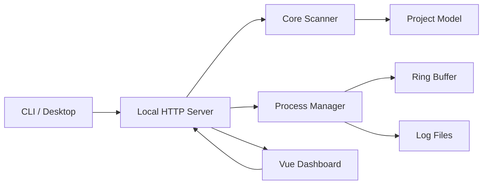

# Dev Cockpit 架构说明

Dev Cockpit 的目标不是替代 IDE，而是恢复本地开发现场：项目入口、启动命令、运行状态、端口、日志、Git 摘要和 AI 上下文。

## 产品边界

Dev Cockpit 只做本地项目恢复：

- 不上传源码。
- 不接团队账号。
- 不做 CI/CD。
- 不替代 IDE。
- 不自动安装依赖。
- 不默认写入用户项目。

这个边界保证它能作为轻量本地工具长期运行，而不是变成重型开发平台。

## 分层

```txt
apps/web
  Vue 3 Dashboard，只负责展示和用户操作。

apps/desktop
  Electron 桌面壳。启动同一个本地 server，并用原生窗口承载 Vue 面板。

packages/cli
  npx 入口。启动 server、打开浏览器，并提供 scan / doctor / context 命令。

packages/server
  本地 HTTP API。负责配置、扫描聚合、进程启停、日志、端口状态、更新检查和本机能力。

packages/core
  纯 TypeScript 核心。负责项目识别、命令推断、Git 状态、端口候选和上下文生成。
```

`core` 是最稳定边界，不依赖 Vue、HTTP、CLI 或 Electron。桌面版复用 `apps/web` 和 `packages/server`，不复制业务逻辑。

## Server 内部边界

`packages/server` 不再把所有能力堆在 `server.ts`。入口文件只负责启动 HTTP server、WebSocket、静态资源和服务组合；API 分发放在 `src/routes.ts`，独立能力放在 `src/services`：

```txt
services/project-scan-cache.ts
  项目扫描短缓存，避免轮询触发重复全量扫描。

services/port-control.ts
  端口清理、PID 解析、Windows/Unix 停止进程差异。

services/update-checker.ts
  GitHub Release / npm registry 更新检查和下载资产选择。

services/failure-summary.ts
  进程失败日志摘要 facade。规则放在子模块：
  - failure-summary/port-conflict.ts：Next、Uvicorn、Node 等端口占用摘要。
  - failure-summary/python.ts：ModuleNotFoundError、Conda/venv/解释器安装建议。
  - failure-summary/node.ts：Node 缺包、本地模块缺失和脚本二进制缺失。
  - failure-summary/ecosystems.ts：PHP/Ruby/.NET 依赖恢复建议。
  - failure-summary/fallback.ts：未知错误的优先行提取。

services/native-shell.ts
  打开文件夹、选择根目录、打开编辑器等本机 shell 能力。

services/project-service.ts
  项目加载和聚合。负责 root 扫描、单项目加载、运行状态和错误摘要合并。

services/port-status.ts
  端口状态 facade，只编排项目端口聚合并保留对外导出。具体规则放在子模块：
  - port-status/port-owners.ts：外部监听进程读取、缓存、项目路径归属和端口 claim。
  - port-status/port-probes.ts：HTTP 可达性探测、wildcard host 到 loopback 候选地址解析。
  - port-status/port-logs.ts：日志 URL/端口解析，以及 Next/Uvicorn 等端口占用日志识别。
  - port-status/port-normalizer.ts：扫描端口、外部端口、托管进程端口合并和 stale 过滤。
  - port-status/run-state.ts：lastRun/lastError 水合、过期失败过滤和缺失命令识别。

services/context-files.ts
  生成 Web 端 AI 上下文响应，并在用户显式请求时写入 PROJECT_CONTEXT.md / AGENTS.md。

services/command-guards.ts
  启动命令前的重复运行、端口占用和残留端口拦截。

services/command-environment.ts
  运行环境 facade。保留对外入口，编排各 runtime resolver。

services/runtime/shared.ts
  运行时公共类型、命令可用性检查、跨平台 command + args 封装和文件读取辅助。

services/runtime/node.ts
  npm/pnpm/yarn/bun/Corepack fallback、Node 依赖预诊断和 workspace root 判断。

services/runtime/python.ts
  Python runtime facade，只保留对外入口。具体规则放在子模块：
  - runtime/python/candidates.ts：环境候选聚合，供 Web 运行环境区和 doctor 使用。
  - runtime/python/local-env.ts：项目内、父级工作区和当前终端继承的 venv/Conda 解释器。
  - runtime/python/vscode.ts：`.vscode/settings.json` 解释器路径解析。
  - runtime/python/conda.ts：`environment.yml`、`conda env list --json`、`conda:环境名` 候选。
  - runtime/python/project-tools.ts：uv、Poetry、Pipenv runner 识别。
  - runtime/python/binding.ts：用户手动绑定的 python.exe、环境目录和 conda 绑定校验。
  - runtime/python/invocation.ts：按优先级生成最终 `command + args`。
  - runtime/python/diagnostics.ts：依赖环境未固定时的用户可读提示。

services/runtime/java.ts
  JDK 可用性、Maven/Gradle wrapper 诊断。

services/runtime/dependency-diagnostics.ts
  PHP/Ruby/.NET 依赖提示，以及 Node/Python/Java 等生态诊断分发。

services/runtime/messages.ts
  运行时缺失、包管理器缺失等用户可读错误文案。
```

后续新增模块时遵守这个方向：

- 路由只做请求解析、权限边界和响应。
- 业务能力放到 service。
- 可复用项目识别能力放到 `core`。
- UI 展示逻辑放到 `apps/web/src/features/<module>`。
- `process-manager.ts` 只维护进程生命周期，不直接承载运行时识别规则。
- 新增 API 先扩展 `routes.ts` 或拆出 route handler，不要把分发逻辑写回 `server.ts`。
- 新增失败摘要必须作为 `FailureRule` 子模块，并补对应测试。
- 新增运行时优先进入 `services/runtime/<ecosystem>.ts`，不要把生态规则重新堆回 `command-environment.ts`。
- 新增端口、项目聚合、上下文写入能力时优先扩展对应 service，不要回填到 `server.ts`。

## Core Scanner 边界

`packages/core/src/scanner.ts` 是扫描编排入口，只负责 root 遍历、项目模型组合和 Git/端口汇总。内部规则放在 `src/scanner` 子目录：

```txt
scanner/strategy.ts
  忽略目录、项目 marker 判断、工作区继续下钻规则和候选项目保留策略。

scanner/commands.ts
  命令检测聚合。负责调用各生态 detector，并统一去重。

scanner/detectors/*.ts
  Node、Python、Java、PHP、Ruby、.NET、Go/Rust/Docker 等生态的命令识别规则。
```

后续继续扩展生态时，应把规则放进对应 `scanner/detectors/<ecosystem>.ts`，再由 `commands.ts` 聚合导出；不要把新框架规则写回 `scanner.ts`。

## 数据流



核心对象是 `Project`：

```ts
Project {
  id: string
  name: string
  path: string
  kind: "node" | "python" | "go" | "rust" | "docker" | "mixed" | "unknown"
  git: { branch: string; dirtyCount: number; lastCommit?: string }
  commands: Command[]
  ports: PortStatus[]
  lastRun?: ProcessRun
  lastError?: ErrorSummary
}
```

前端不直接推断项目状态。它只消费 server 返回的项目模型，并通过项目视图模型做展示层归类：

```txt
project-view-ports.ts
  端口筛选、端口 URL、端口冲突和启动端口复用判断。

project-view-status.ts
  在线、空闲、失败、需清理等状态模型，以及排序、搜索、路径归属。

project-view-diagnostics.ts
  概况诊断卡片、失败原因和下一步建议。

project-view.ts
  兼容入口，只 re-export 上述展示层能力。
```

项目页样式也按展示职责拆分，入口是 `apps/web/src/styles/features/projects.css`，具体样式在 `features/projects/` 子目录：

```txt
projects/list.css
  项目列表、项目行、状态点和列表骨架屏。

projects/detail.css
  项目详情 shell、标题、路径和快捷动作。

projects/overview.css
  概况卡片、状态带、端口区域和元信息 chip。

projects/diagnostics.css
  诊断折叠面板、诊断卡片和 Python 环境绑定区。

projects/commands.css
  命令面板、命令行状态和命令提示。

projects/logs.css
  日志正文区域。

projects/context.css
  AI 上下文预览和复制操作。

projects/onboarding.css
  空工作区、欢迎引导和首次使用动画。
```

后续改项目页 UI 时，优先改对应 CSS 文件；只有跨项目页的通用控件才放回 `components.css`。

## 扫描策略

扫描从用户配置的 root 开始，按深度递归查找项目标记：

- `.git`
- `package.json`
- `requirements.txt`
- `pyproject.toml`
- `go.mod`
- `Cargo.toml`
- `Dockerfile`
- `docker-compose.yml`
- `pom.xml`
- `build.gradle`
- `composer.json`
- `Gemfile`
- `.csproj` / `.sln`

默认忽略：

```txt
node_modules
.git
dist
build
.venv
target
.next
.cache
```

扫描有深度、数量和超时保护。工作区越具体，体验越稳定；不建议直接扫描整块磁盘。

## 命令模型

命令统一保存为结构化数据：

```ts
Command {
  id: string
  label: string
  command: string
  args: string[]
  cwd: string
  source: "package-script" | "detected" | "user"
  kind: "dev" | "test" | "build" | "start" | "custom"
}
```

执行时使用 `command + args`，不拼接 shell 字符串，降低跨平台差异和命令注入风险。

第一阶段只自动执行可信来源：

- `package.json scripts`
- 框架标准命令
- 后续用户显式添加的命令

## 状态模型

项目状态来自多路合并：

1. `托管运行`：Dev Cockpit 自己启动的进程仍在运行。
2. `外部在线`：系统端口和进程命令行能归属到当前项目，并且 HTTP 可访问。
3. `需清理`：端口属于当前项目或命令声明端口，但 HTTP 不可访问。
4. `异常`：最近一次命令失败。
5. `空闲`：没有运行服务。

公共端口不会直接作为在线证据。例如 `localhost:3000` 被未知进程占用时，不会把所有 Node 项目都标成在线。

## 运行环境解析

命令推断和运行环境解析分开：

- `core` 推断“应该怎么跑”。
- `server` 在启动前根据当前机器解析“实际用哪个运行时跑”。

Python 优先级：

1. 项目级手动绑定。
2. `.vscode/settings.json`。
3. 项目内 `.venv` / `venv` / `.conda`。
4. 父级工作区虚拟环境。
5. `environment.yml` 的 Conda 环境。
6. uv / Poetry / Pipenv。
7. 启动 Dev Cockpit 的终端继承环境。
8. 系统 Python 或 Windows `py`。

Java 优先使用 `mvnw` / `gradlew` wrapper；没有 wrapper 再用系统 Maven/Gradle。JDK 缺失会在启动前拦截。

Node 优先使用 `packageManager` 字段和 lockfile 推断包管理器。pnpm/yarn 会优先尝试 Corepack；必要时在存在 npm lockfile 的项目里回退 npm。

## 日志策略

进程输出同时进入：

- 内存 ring buffer：用于实时展示。
- 本地日志文件：用于刷新后恢复。

日志目录：

```txt
%APPDATA%\local-dev-cockpit\logs
```

停止后的历史日志不会默认铺满页面，需要用户显式查看，避免“没操作就出现日志”的误解。

## 性能策略

Dev Cockpit 需要能长期挂着，所以默认避免高频全量扫描：

- 当前 root 的扫描结果在 server 侧短时间缓存。
- 手动刷新会绕过缓存。
- 运行中项目才高频刷新日志和状态。
- 页面隐藏时暂停自动刷新。
- 端口探测按 host/port 去重。
- Windows 端口和进程命令行查询短时间复用。
- 性能面板只展示 Dev Cockpit 自身开销，不触发项目扫描。

这个策略牺牲几秒级的外部状态发现速度，换取长期后台运行时更低的 CPU 和磁盘占用。

## 本地配置

```txt
%APPDATA%\local-dev-cockpit\config.json
%APPDATA%\local-dev-cockpit\state.json
%APPDATA%\local-dev-cockpit\logs\*.log
```

配置包含 root、编辑器命令和项目级 Python 环境绑定。语言、主题和强调色属于前端偏好，保存在浏览器 `localStorage`。

## 发布策略

`packages/cli` 发布到 npm，包内置：

- CLI 入口
- server bundle
- core bundle
- Vue 面板静态产物

用户只需要：

```bash
npx local-dev-cockpit
```

桌面端使用 Electron。主进程启动同一个本地 server，再加载本地 Web 面板。它只是原生包装层，不维护第二套 UI 和业务逻辑。

## 当前痛点

- 端口归属在 Windows 上相对可控，macOS/Linux 还需要补更强的进程归属策略。
- Python/Conda 场景复杂，自动识别只能覆盖常见结构，仍需要手动绑定兜底。
- 真实项目框架差异大，命令推断需要持续增加 fixture 和真实案例。
- Electron 安装包未签名，普通用户下载时会遇到 Windows 安全提示。
- 当前没有自动更新，只能检查更新并跳转下载。
- UI 信息密度已经收敛，但仍需要根据真实用户反馈继续决定默认隐藏哪些信息。
