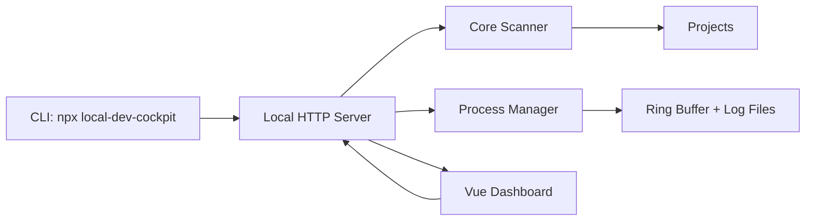

# Dev Cockpit 架构说明

Dev Cockpit 的目标不是替代 IDE，而是补齐 IDE 不擅长保存的“开发现场”：项目入口、启动命令、运行状态、端口、日志、Git 摘要和 AI 上下文。

## 分层

```txt
apps/web
  Vue 3 Dashboard，只负责展示和用户操作。

packages/cli
  npx 入口。启动 server、打开浏览器，并提供 scan / doctor / context 命令。

packages/server
  本地 HTTP API。负责读取配置、扫描项目、启动/停止进程、记录日志、推送事件。

packages/core
  纯 TypeScript 核心。负责项目识别、命令推断、Git 状态、端口检测和上下文生成。
```

`core` 是最稳定的边界。它不依赖 Vue、HTTP、CLI，也不直接假设桌面端存在。未来 Electron/Tauri 只需要复用 `apps/web` 和 `packages/server`。

## 数据流



## 项目扫描策略

扫描从用户配置的 root 开始，按深度递归寻找项目标记：

- `.git`
- `package.json`
- `requirements.txt`
- `pyproject.toml`
- `go.mod`
- `Cargo.toml`
- `Dockerfile`
- `docker-compose.yml`

默认忽略 `node_modules`、`.git`、`dist`、`build`、`.venv`、`target`、`.next`、`.cache` 等目录。扫描有最大深度、最大项目数和超时保护，避免误扫整个磁盘。

## 命令执行策略

命令统一保存为：

```ts
{
  command: string
  args: string[]
  cwd: string
}
```

这样可以避免把用户输入拼进 shell 字符串，降低跨平台和注入风险。第一版只自动执行可信来源命令：`package.json scripts`、标准框架命令、用户后续显式添加的命令。

## 日志策略

进程输出会同时进入：

- 内存 ring buffer：用于 WebSocket 实时显示。
- 本地日志文件：用于刷新页面后恢复。

日志目录：

```txt
%APPDATA%\local-dev-cockpit\logs
```

## AI 上下文策略

第一版不接入 AI API。`context` 能力只做确定性摘要：

- 项目名称和路径。
- 技术栈和 package manager。
- Git 分支、dirty 文件数和最近提交。
- 可用命令。
- 端口状态。
- 最近运行和失败摘要。

这样输出可复现、可审查，也不会把代码上传到第三方服务。

## 发布策略

`packages/cli` 发布时使用 `esbuild` 打包 CLI、server、core 和 Node 依赖，并把 `apps/web/dist` 复制到 `packages/cli/dist/web`。最终 npm 包只需要一个 CLI 包即可运行，不要求用户额外安装内部 workspace 包。
